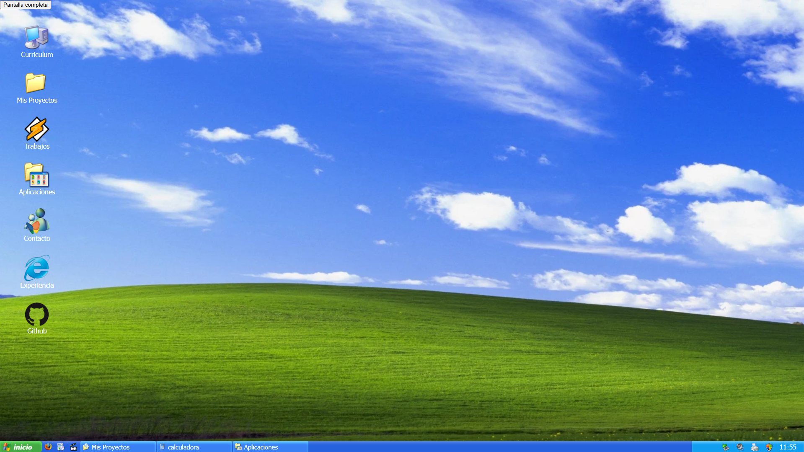

# 💻 Portfolio – Windows XP Edition

<p align="left">
  <a href="https://pampa32.github.io/Portfolio-Windows-XP/">
    
  </a>
  
  
  
</p>

<p align="left">
  
  
  
</p>

Un portfolio personal interactivo inspirado en la interfaz clásica de **Windows XP**.

🌐 **Live Demo:**  
👉 https://pampa32.github.io/Portfolio-Windows-XP/

---

## 🖥️ Concepto

Este proyecto recrea la experiencia visual del sistema operativo Windows XP, transformándolo en un portfolio navegable donde cada icono funciona como una sección interactiva.

La idea es combinar **nostalgia + frontend moderno**, demostrando creatividad y control del DOM con JavaScript.

---

## ✨ Características

- 🟦 Interfaz estilo Windows XP
- 📂 Iconos interactivos tipo escritorio
- 🪟 Ventanas dinámicas
- 📱 Responsive
- ⚡ Animaciones y control de estado con JavaScript
- 🌍 Deploy automático con GitHub Pages

---

## 🛠️ Tecnologías

- HTML5
- CSS3
- JavaScript Vanilla

---

## 📸 Preview



---

## 🚀 Instalación local

Clonar el repositorio:

```bash
git clone https://github.com/Pampa32/Portfolio-Windows-XP.git
